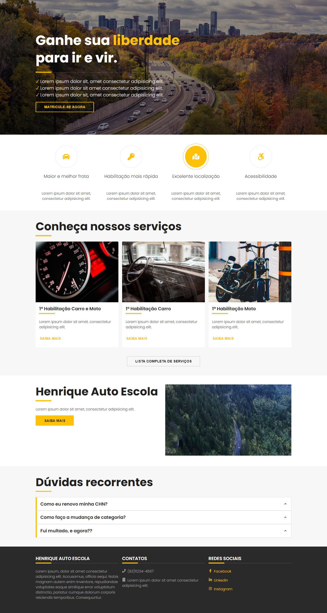

# Introdução

Frontend de uma _Autoescola_ feito em **React**.

## Sites úteis

-   storybook: https://storybook.js.org/docs/react/get-started/install
-   pixabay: https://pixabay.com/

### Comandos

-   **documentação**: `npm run storybook`
-   **aplicação react**: `npm start`
-   **teste**: `npm run test`
-   **cobertura**: `npm run test:coverage`

### Temas

Por padrão a aplicação utiliza o `theme: 'light'`, que tem como cor principal o
amarelo. Em `ThemeProvider`, dentro do diretório `styles`, é possível criar
outros temas e usá-los como tema da aplicação. Para alterar o tema da aplicação
é necessário passar o nome do tema dentro da propriedade `theme` do
ThemeProvider (`<ThemeProvider theme="ocean" />`) em `App.js` ou alterar o
`ThemeProvider.defaultProps` em ThemeProvider.

### Aplicação

